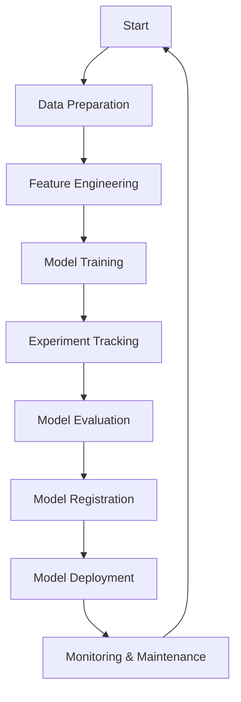

# End-to-End Workflow with MLflow Using Iris Dataset

This project demonstrates how to manage the machine learning lifecycle using MLflow and the Iris dataset. The workflow includes data preparation, model training, experiment tracking, evaluation, model registration, and deployment.

---

## Workflow Overview



---

## Steps in the Workflow

### 1. Create a Virtual Environment

Before starting, it's a good practice to create a virtual environment to isolate dependencies for this project.

```bash
# Create a virtual environment
python -m venv mlflow-env

# Activate the virtual environment
# On Windows
mlflow-env\Scripts\activate
# On macOS/Linux
source mlflow-env/bin/activate
```

Once the environment is activated, install the dependencies:

```bash
pip install -r requirements.txt
```

---

### 2. Start MLflow Tracking Server

To enable experiment tracking, start the MLflow Tracking Server in your terminal:

```bash
mlflow ui
```

The MLflow UI will be available at [http://localhost:5000](http://localhost:5000).

---

### 3. Data Preparation

- Load the Iris dataset using Scikit-learn.
- Split the data into training and testing sets.

```python
from sklearn.datasets import load_iris
from sklearn.model_selection import train_test_split

# Load Iris Dataset
data = load_iris()
X, y = data.data, data.target
X_train, X_test, y_train, y_test = train_test_split(X, y, test_size=0.2, random_state=42)
```

---

### 4. Feature Engineering

- Standardize features using `StandardScaler` to ensure consistency.

```python
from sklearn.preprocessing import StandardScaler

# Scale the features
scaler = StandardScaler()
X_train = scaler.fit_transform(X_train)
X_test = scaler.transform(X_test)
```

---

### 5. Model Training

- Train a Random Forest Classifier with predefined hyperparameters.

```python
from sklearn.ensemble import RandomForestClassifier

# Train the model
model = RandomForestClassifier(n_estimators=100, max_depth=5, random_state=42)
model.fit(X_train, y_train)
```

---

### 6. Experiment Tracking with MLflow

- Log experiments, hyperparameters, metrics, and artifacts in MLflow.

```python
import mlflow
import mlflow.sklearn
from sklearn.metrics import accuracy_score

mlflow.set_experiment("Iris_Classification")

with mlflow.start_run():
    # Log model parameters
    mlflow.log_param("n_estimators", 100)
    mlflow.log_param("max_depth", 5)

    # Make predictions and calculate accuracy
    y_pred = model.predict(X_test)
    accuracy = accuracy_score(y_test, y_pred)
    mlflow.log_metric("accuracy", accuracy)

    # Log model
    mlflow.sklearn.log_model(model, "model")
    print(f"Model logged with accuracy: {accuracy}")
```

---

### 7. Model Evaluation

- Evaluate the model using metrics such as accuracy and generate a classification report.

```python
from sklearn.metrics import classification_report

# Generate classification report
report = classification_report(y_test, y_pred, output_dict=True)
print(report)

# Save the classification report as an artifact
import json
with open("classification_report.json", "w") as f:
    json.dump(report, f)
mlflow.log_artifact("classification_report.json")
```

---

### 8. Model Registration

- Register the best-performing model in MLflow's Model Registry.

```python
# Register the model in the MLflow Model Registry
mlflow.register_model("runs:/<run_id>/model", "Iris_Classifier")
```

---

### 9. Model Deployment

#### Serve the model
To serve the registered model using MLflow, run the following command (replace `Iris_Classifier` and `2` with the model name and version):

```bash
mlflow models serve --env-manager local -m "models:/Iris_Classifier/2" -p 5555
```

#### Make predictions using the served model
Once the model is served, send test data for inference using the `requests` library:

```python
import requests
import pandas as pd

# Convert test data to a list of records
lst = pd.DataFrame(X_test).values.tolist()

# Prepare inference request payload
inference_request = {
    "dataframe_records": lst
}

# Send request to the model endpoint
endpoint = "http://localhost:5555/invocations"
response = requests.post(endpoint, json=inference_request)

# Display the predictions
print(response.json())
```

---

## Results

- **Best Model**: RandomForestClassifier with `n_estimators=100`, `max_depth=5`.
- **Accuracy**: Achieved 96% accuracy on the test set.
- **Model Registered**: Registered in MLflow Model Registry for deployment.

---

### How to Run the Project

1. Clone the repository:
    ```bash
    git clone https://github.com/your-repo/mlflow-iris-example.git
    cd mlflow-iris-example
    ```

2. Create and activate a virtual environment:
    ```bash
    python -m venv mlflow-env
    # Activate the environment:
    # On Windows
    mlflow-env\Scripts\activate
    # On macOS/Linux
    source mlflow-env/bin/activate
    ```

3. Install dependencies:
    ```bash
    pip install -r requirements.txt
    ```

4. Start MLflow Tracking Server:
    ```bash
    mlflow ui
    ```

5. Run the training script:
    ```bash
    python iris_pipeline.py
    ```

6. Serve the registered model:
    ```bash
    mlflow models serve --env-manager local -m "models:/Iris_Classifier/2" -p 5555
    ```

7. Send a prediction request:
    ```python
    python make_predictions.py
    ```

---

